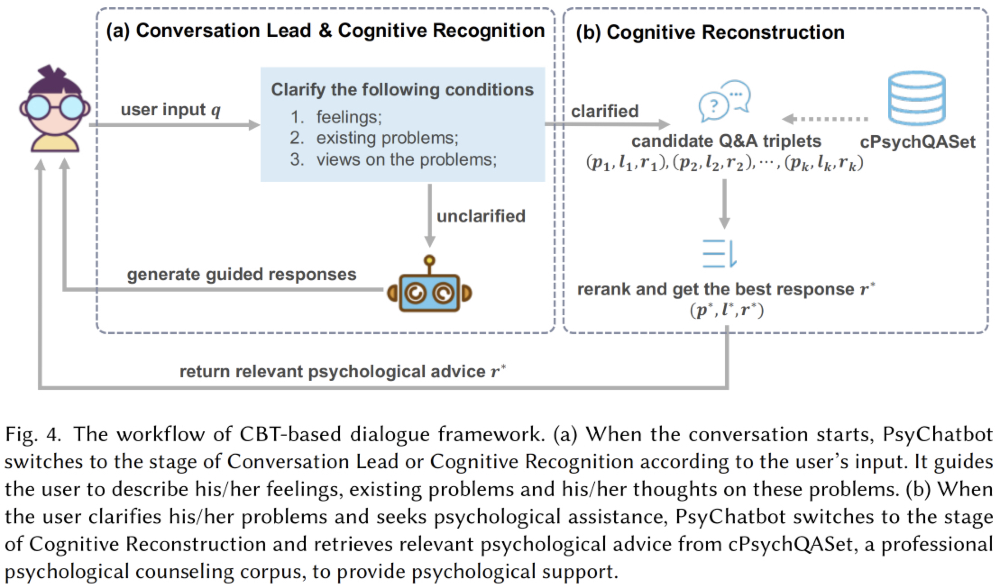

# PsyChatbot: A Psychological Counseling Agent Towards Depressed Chinense Population Based on Cognitive Behavioral Therapy

This repository contains the source code and data for our TALLIP 2024 paper：

T. Chen, Y. Shen, X. Chen, and L. Zhang, “[PsyChatbot: A Psychological Counseling Agent Towards Depressed Chinese Population Based on Cognitive Behavioural Therapy](https://dl.acm.org/doi/10.1145/3676962),” *ACM Transactions on Asian and Low-Resource Language Information Processing*, Jul. 2024, doi: 10.1145/3676962.



Please cite our paper if you find our work helpful.

## 🎉 News

- [2024.07.02] Our paper has been accepted by TALLIP.
- [2025.03.19] We provide an English version of cPsychQASet.

## 🛠️ Environment Settings

Our basic environment configuations are as follows:

- Operating System: Ubuntu 18.04
- CUDA: 10.1.105
- Python: 3.6.13
- TensorFlow: 1.15.0


## 📄 Dataset: cPsychQASet

cPsychQASet is a Chinese psychological Q\&A dataset that consists of nearly 89,000 Q\&A pairs.
Each Q\&A pair comprises attributes including question ID (q_id), question title, question description, best answer, and topic labels. To facilitate further research, the English version of cPsychQASet is available now.
Some of the Q&A pairs in cPsychQASet are shown in the table below:

**[Chinese Version]**

| q_id | title | description | best answer | topic |
| ---- | ----- | ----------- | ----------- | ----- |
|259055|如何克服不自信|每当遇到事情的时候就是胆怯没信心害怕担心做不好选择逃避 |首先祝贺你觉察并接纳了“没做好并不等于做不好，一件事怎么做是好的怎么做是更好的，有的时候并没有唯一的标准，所以你对自己的标准是什么样的呢？其实不管怎样，行动就是你的，有了行动就是走出了舒适区，就是成功！所以没做好还可以再做，想一想在现有的基础上，再增加点什么，可能就更好了，根据我的案例经验，相信能够帮助到你哦，一个人的职业生涯从起步走向成熟，离不开职业生涯咨询的助力。|职业发展(career)|
|30689|如何与孩子亲密交流|如何与孩子亲密交流，儿子17，感觉孩子有事不爱和我说，怎样才能和他沟通？？？ |17岁男孩子这个阶段是与母亲有些疏离，可以让爸爸多参与爱孩子不是把孩子罩在自已的翅膀下，而是要让他学会独自飞！高尔基说过，爰孩子是母鸡都会的事情，而教育孩子却是国家大事。我们做父母的，不能以爱的名义阻挡了孩子翅膀的伸展和练习飞翔的机会，鹰的孩子只能长大为一只鸡！| 家庭关系(family)|
|194736| 为什么一男生喜欢你当你靠近的时候又会离... |为什么一男生喜欢你当你靠近的时候又会离得远远的。别人都能从他的眼中看出喜欢，但是你想靠近的时候他确远离 | 适当的空间感是要有的不是所有的男生都这样有些比较腼腆慢慢会适应的慢慢来，不要着急相信自己，做一个自信的人，交往要学会正确合理的交流方式，祝你生活愉快请问他是不是射手座的，从性格上来说，有些男人控制欲，征服欲强，他喜欢难追的，追到了就没有刺激感了可能是害羞，也可能是缺乏安全感，毕竟身体是最真实的情感反应，先不要太主动靠近，两个可以好好聊聊，明白他的想法，才能更好的走进对方。|恋爱婚姻(love)|
|63071|无法面对失败！|考试退步了，感觉在班里面子都丢尽了！而且自己也一直暗地里与邻居家的发小比成绩！感觉心里低沉沉的！ |你在乎考试成绩说明你是个有上进心的人，你已经为这次考试努力过了，成绩虽然失败了，可你的这份上进心是另一种成功。 |情绪压力(emotion)，个人成长(growth)|

**[English Version]**

| q_id | title | description | best answer | topic |
| ---- | ----- | ----------- | ----------- | ----- |
|259055|How to overcome lack of confidence|Whenever I encounter something, I am timid, I have no confidence, I am afraid, I am worried that I cannot do it well, and I choose to escape. |First of all, congratulate you on realizing and accepting that \"not doing it well does not mean not doing it well. How to do something is good or how to do it is better. Sometimes there is no only standard, so what are your standards for yourself? In fact, no matter what, action is yours. With action, you are getting out of your comfort zone and success! So if you haven't done it well, you can do it again. Think about adding something to the existing foundation. It might be better. Based on my case experience, I believe it can help you. A person's career starts from the beginning to maturity. It is inseparable from the help of career consulting.|Career Development|
|30689|How to communicate closely with children|How to communicate closely with my child? My son is 17. I feel that my child doesn't like to talk to me. How can I communicate with him??? | The 17-year-old boy is a little alienated from his mother at this stage. It is not about letting his father participate more in loving his children, but about letting him learn to fly alone! Gorky once said that children are something that hens can do, but educating children is a national matter. As parents, we cannot block our children's opportunities to stretch their wings and practice flying in the name of love. An eagle's child can only grow up as a chicken! | Family |
|194736| Why does a guy like you and leave you when you get close... |Why does a guy like you and stay far away when you get close? Others can see that they like him in his eyes, but when you want to get close, he stays away | A proper sense of space is that not all boys are like this, some are shy, and they will adapt slowly. Don't rush to believe in yourself, be a confident person, and learn correct and reasonable communication methods when communicating. I wish you a happy life. May I ask if he is a Sagittarius? In terms of character, some men have a desire to control and conquer. He likes difficult to pursue, and there will be no excitement after chasing him. It may be shyness or lack of security. After all, the body is the most real emotional reaction. Don't take the initiative to get close first. The two can have a good chat and understand his thoughts so that they can better approach each other. |Love and Marriage|
|63071|Unable to face failure!|The exam regressed, and I felt like I had lost face in class! Moreover, he has been secretly comparing his junior grades with his neighbors! I feel depressed in my heart! |If you care about the test results, you are a motivated person. You have worked hard for this test. Although your results have failed, your ambition is another kind of success. |Emotions, Growth|

The entire dataset has been uploaded to Google Drive, and the link is https://drive.google.com/file/d/1HgbnT_zFgbNZ9WvAs47q7EBbTlrlj9Um/view?usp=drive_link (English version: https://drive.google.com/file/d/1DHui3c99Jz4SBTe_YhYnhd-LWXmUs6D4/view?usp=drive_link). However, due to ethical considerations, the data files have been encrypted, requiring contact with 2111287@tongji.edu.cn to obtain the password. Please note that when inquiring, kindly provide your institution and purpose, ensuring that the dataset is used only for academic purposes.


## 🤖 Code

You can execute our code through the following steps:

- Before running the code, please download data files from the link mentioned above.
- Then, place the folders ``Code/data`` and ``Code/topic`` in the downloaded files into the ``FAQ`` directory of the codebase. 
- Train the topic prediction model:
  ```
  cd ./topic
  python train.py
  ```
- Run the counseling agent with the following command:
  ```
  python run.py
  ```
